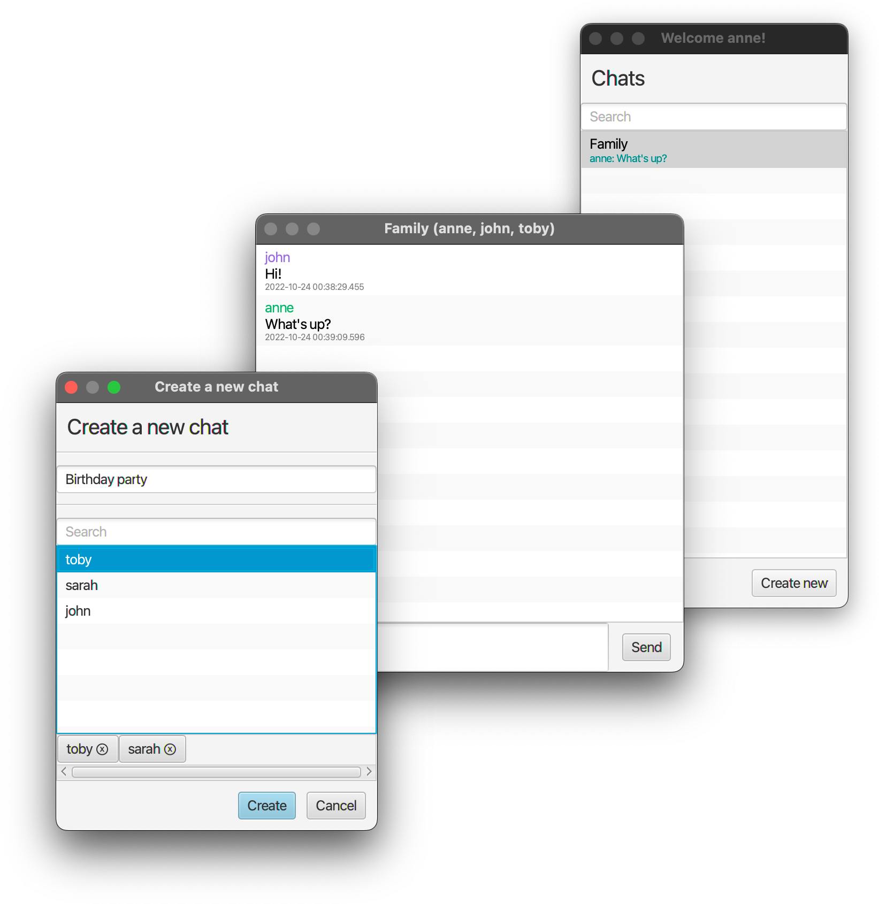

# ChatApp

Project for the 2021/2022 Software Engineering course.

The main goal of the project was to practice how to model the logic in such a way that it is abstracted from its implementation.
To do this, we used Domain-driven design and simple design patterns like abstract factory to invert dependencies.

We also focused on following generally known best practices and maximizing the testability of the logic;
for example, we used constructors solely for dependency injection.

Functionalities:

- registering users,
- creating group conversations,
- sending and receiving messages in real time over a WebSocket connection,
- persisting data using simple SQLite databases.

